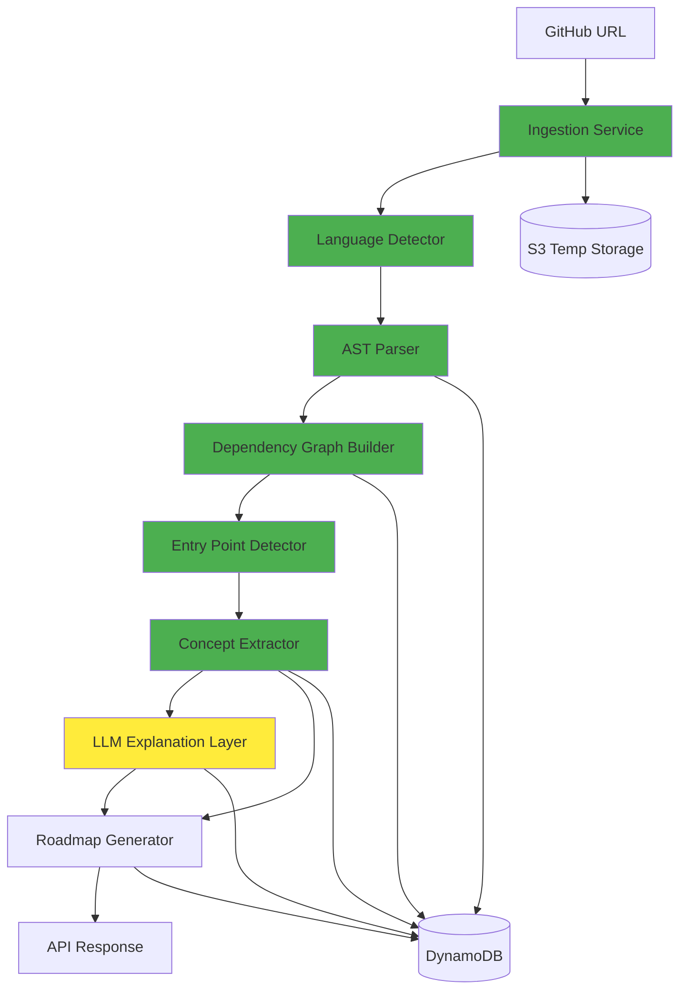

# Design Document: CODEXPATH AI

## Overview

CODEXPATH AI is a structured code intelligence system that combines deterministic static analysis with LLM-based explanations. The architecture strictly separates factual code analysis (AST-based, deterministic) from AI-generated interpretations (LLM explanations only).

**Core Principle:** LLM never directly analyzes raw code. All structural analysis is AST-based and deterministic.

## High-Level Architecture

### Pipeline Description

```
Repository URL → Ingestion → Language Detection → AST Parsing → Dependency Graph → 
Concept Extraction → LLM Explanation → Roadmap Generation → API Response
```

### Component Separation

**Deterministic Components (FACT):**
- Repository ingestion and validation
- Language and framework detection
- AST parsing (Babel/TypeScript for JS, ast module for Python)
- Dependency graph construction
- Entry point detection
- Concept extraction (rule-based pattern matching)
- Roadmap structure generation

**LLM Components (INFERENCE):**
- Concept explanations (Amazon Bedrock)
- Learning recommendations (Amazon Bedrock)

### Architecture Diagram



**Legend:** Green = Deterministic (FACT), Yellow = LLM (INFERENCE)


## Component Breakdown

### 1. Repository Ingestion Service

**Purpose:** Clone and validate GitHub repositories

**Responsibilities:**
- Accept GitHub repository URLs via REST API
- Validate URL format and repository accessibility
- Clone repository to S3 temporary storage
- Enforce size limit (100MB maximum)
- Validate presence of JavaScript or Python files
- Generate unique repository ID
- Trigger downstream analysis pipeline

**Technology:** AWS Lambda (Python with GitPython)

**Input:**
```json
{
  "repositoryUrl": "https://github.com/user/repo",
  "userId": "user_123"
}
```

**Output:**
```json
{
  "repositoryId": "repo_abc123",
  "status": "cloned",
  "size": "15.2MB",
  "fileCount": 247,
  "s3Location": "s3://codexpath-temp/repo_abc123"
}
```

**Failure Handling:**
- Invalid URL → Return HTTP 400 with error details
- Repository not accessible → Return HTTP 404
- Size exceeds 100MB → Return HTTP 413 with size info
- Clone timeout (30s) → Return HTTP 504
- No JS/Python files → Return HTTP 422 with detected languages

**Data Format:**
- Repository stored as compressed archive in S3
- Metadata stored in DynamoDB with TTL (1 hour)

### 2. Language Detector

**Purpose:** Identify programming languages and frameworks (deterministic)

**Responsibilities:**
- Scan repository file tree
- Identify JavaScript files (.js, .jsx, .ts, .tsx)
- Identify Python files (.py)
- Parse package.json for JavaScript frameworks
- Parse requirements.txt and pyproject.toml for Python frameworks
- Calculate language distribution percentages
- Extract framework versions

**Technology:** AWS Lambda (Python)

**Input:**
```json
{
  "repositoryId": "repo_abc123",
  "s3Location": "s3://codexpath-temp/repo_abc123"
}
```

**Output:**
```json
{
  "languages": {
    "javascript": {
      "fileCount": 45,
      "percentage": 65.2,
      "extensions": [".js", ".jsx"]
    },
    "python": {
      "fileCount": 24,
      "percentage": 34.8,
      "extensions": [".py"]
    }
  },
  "frameworks": [
    {"name": "express", "version": "4.18.2", "language": "javascript"},
    {"name": "react", "version": "18.2.0", "language": "javascript"},
    {"name": "flask", "version": "2.3.0", "language": "python"}
  ],
  "tag": "FACT"
}
```

**Failure Handling:**
- Missing dependency files → Continue with file extension detection only
- Malformed JSON/TOML → Log warning, skip framework detection
- File read errors → Skip file, continue processing

**Data Format:**
- Language statistics stored in DynamoDB
- Tagged as "FACT" (deterministic analysis)

### 3. AST Parser

**Purpose:** Parse source code into Abstract Syntax Trees (deterministic)

**Responsibilities:**
- Parse JavaScript/TypeScript files using Babel or TypeScript compiler
- Parse Python files using Python's ast module
- Extract function definitions (name, parameters, return types)
- Extract class definitions (name, methods, inheritance)
- Extract import/export statements
- Handle parsing errors gracefully
- Store AST data as structured JSON

**Technology:** 
- AWS Lambda (Node.js) for JavaScript/TypeScript parsing
- AWS Lambda (Python) for Python parsing

**JavaScript Parsing (using @babel/parser):**
```javascript
const parser = require('@babel/parser');
const traverse = require('@babel/traverse').default;

function parseJavaScript(code, filePath) {
  const ast = parser.parse(code, {
    sourceType: 'module',
    plugins: ['jsx', 'typescript']
  });
  
  const functions = [];
  const classes = [];
  const imports = [];
  
  traverse(ast, {
    FunctionDeclaration(path) {
      functions.push({
        name: path.node.id.name,
        parameters: path.node.params.map(p => p.name),
        isAsync: path.node.async,
        lineStart: path.node.loc.start.line,
        lineEnd: path.node.loc.end.line
      });
    },
    ClassDeclaration(path) {
      classes.push({
        name: path.node.id.name,
        superClass: path.node.superClass?.name,
        methods: path.node.body.body.map(m => m.key.name)
      });
    },
    ImportDeclaration(path) {
      imports.push({
        source: path.node.source.value,
        specifiers: path.node.specifiers.map(s => s.local.name)
      });
    }
  });
  
  return { functions, classes, imports };
}
```

**Python Parsing (using ast module):**
```python
import ast

def parse_python(code, file_path):
    tree = ast.parse(code)
    
    functions = []
    classes = []
    imports = []
    
    for node in ast.walk(tree):
        if isinstance(node, ast.FunctionDef):
            functions.append({
                'name': node.name,
                'parameters': [arg.arg for arg in node.args.args],
                'isAsync': isinstance(node, ast.AsyncFunctionDef),
                'lineStart': node.lineno,
                'lineEnd': node.end_lineno
            })
        elif isinstance(node, ast.ClassDef):
            classes.append({
                'name': node.name,
                'bases': [base.id for base in node.bases if isinstance(base, ast.Name)],
                'methods': [n.name for n in node.body if isinstance(n, ast.FunctionDef)]
            })
        elif isinstance(node, ast.Import):
            imports.extend([{'module': alias.name} for alias in node.names])
        elif isinstance(node, ast.ImportFrom):
            imports.append({
                'module': node.module,
                'names': [alias.name for alias in node.names]
            })
    
    return {'functions': functions, 'classes': classes, 'imports': imports}
```

**Input:**
```json
{
  "repositoryId": "repo_abc123",
  "files": ["src/index.js", "src/utils.py"]
}
```

**Output:**
```json
{
  "files": [
    {
      "path": "src/index.js",
      "language": "javascript",
      "functions": [
        {
          "name": "main",
          "parameters": ["req", "res"],
          "isAsync": true,
          "lineStart": 10,
          "lineEnd": 25,
          "isExported": true
        }
      ],
      "classes": [],
      "imports": [
        {"source": "express", "specifiers": ["express"]},
        {"source": "./utils", "specifiers": ["helper"]}
      ],
      "exports": ["main"],
      "tag": "FACT"
    }
  ]
}
```

**Failure Handling:**
- Syntax errors → Log error, mark file as unparseable, continue
- Unsupported syntax → Extract partial data, log warning
- File read errors → Skip file, continue processing
- Timeout (5s per file) → Mark as timeout, continue

**Data Format:**
- AST data stored in DynamoDB as compressed JSON
- Each file's AST stored separately for efficient retrieval
- Tagged as "FACT" (deterministic parsing)

### 4. Dependency Graph Builder

**Purpose:** Construct directed graph of module dependencies (deterministic)

**Responsibilities:**
- Build graph from import statements extracted by AST parser
- Create nodes for each file with metadata
- Create directed edges for import relationships
- Detect circular dependencies using DFS-based cycle detection
- Calculate dependency depth using topological sort
- Identify entry points (nodes with zero incoming edges)
- Serialize graph to JSON

**Technology:** AWS Lambda (Python with networkx)

**Algorithm:**
```python
import networkx as nx

def build_dependency_graph(ast_data):
    G = nx.DiGraph()
    
    # Add nodes
    for file_data in ast_data:
        G.add_node(file_data['path'], 
                   language=file_data['language'],
                   exports=file_data.get('exports', []))
    
    # Add edges
    for file_data in ast_data:
        for import_stmt in file_data['imports']:
            target = resolve_import_path(import_stmt['source'], file_data['path'])
            if target in G:
                G.add_edge(file_data['path'], target)
    
    # Detect cycles
    cycles = list(nx.simple_cycles(G))
    
    # Calculate dependency depth
    try:
        topo_order = list(nx.topological_sort(G))
        depths = {node: i for i, node in enumerate(topo_order)}
    except nx.NetworkXError:  # Graph has cycles
        depths = {}
    
    # Identify entry points
    entry_points = [node for node in G.nodes() if G.in_degree(node) == 0]
    
    return {
        'nodes': list(G.nodes(data=True)),
        'edges': list(G.edges()),
        'cycles': cycles,
        'depths': depths,
        'entryPoints': entry_points
    }
```

**Input:**
```json
{
  "repositoryId": "repo_abc123",
  "astData": [...]
}
```

**Output:**
```json
{
  "graph": {
    "nodes": [
      {
        "id": "src/index.js",
        "language": "javascript",
        "exports": ["main", "app"],
        "dependencyDepth": 0,
        "isEntryPoint": true
      },
      {
        "id": "src/utils.js",
        "language": "javascript",
        "exports": ["helper", "validate"],
        "dependencyDepth": 1,
        "isEntryPoint": false
      }
    ],
    "edges": [
      {"from": "src/index.js", "to": "src/utils.js"},
      {"from": "src/index.js", "to": "src/config.js"}
    ],
    "cycles": [
      ["src/a.js", "src/b.js", "src/a.js"]
    ],
    "entryPoints": ["src/index.js"],
    "tag": "FACT"
  }
}
```

**Failure Handling:**
- Unresolved imports → Log warning, skip edge creation
- Circular dependencies → Detect and report, continue processing
- Graph construction errors → Return partial graph with error flag

**Data Format:**
- Graph stored in DynamoDB as JSON
- Nodes and edges stored separately for efficient queries
- Tagged as "FACT" (deterministic graph construction)

### 5. Entry Point Detection

**Purpose:** Identify starting points for code execution (heuristic-based, deterministic)

**Responsibilities:**
- Identify files with zero incoming dependencies
- Check for conventional entry point filenames
- Parse package.json "main" field
- Parse Python __main__ checks
- Rank entry points by confidence score
- Store entry point metadata

**Technology:** AWS Lambda (Python)

**Detection Heuristics:**

1. **Zero Incoming Dependencies:** Files with no imports from other files
2. **Naming Conventions:**
   - JavaScript: index.js, main.js, app.js, server.js
   - Python: __main__.py, main.py, app.py, run.py
3. **Package Configuration:**
   - package.json "main" field
   - package.json "scripts.start" command
4. **Main Guard Pattern:**
   - Python: `if __name__ == "__main__":`
   - Node.js: `if (require.main === module)`

**Scoring Algorithm:**
```python
def calculate_entry_point_score(file_path, graph, ast_data):
    score = 0.0
    
    # Zero incoming dependencies
    if graph.in_degree(file_path) == 0:
        score += 0.4
    
    # Naming convention
    filename = os.path.basename(file_path)
    if filename in ['index.js', 'main.js', 'app.js', '__main__.py', 'main.py']:
        score += 0.3
    
    # Package.json main field
    if is_package_main(file_path):
        score += 0.2
    
    # Main guard pattern
    if has_main_guard(ast_data, file_path):
        score += 0.1
    
    return min(score, 1.0)
```

**Input:**
```json
{
  "repositoryId": "repo_abc123",
  "graph": {...},
  "astData": [...]
}
```

**Output:**
```json
{
  "entryPoints": [
    {
      "path": "src/index.js",
      "confidence": 0.9,
      "reasons": [
        "Zero incoming dependencies",
        "Conventional filename (index.js)",
        "Listed in package.json main field"
      ],
      "tag": "FACT"
    },
    {
      "path": "scripts/migrate.py",
      "confidence": 0.5,
      "reasons": [
        "Contains __main__ guard"
      ],
      "tag": "FACT"
    }
  ]
}
```

**Failure Handling:**
- No entry points found → Return empty list with warning
- Multiple high-confidence entry points → Return all with scores
- Package.json parse error → Skip package-based detection

**Data Format:**
- Entry points stored in DynamoDB with confidence scores
- Tagged as "FACT" (rule-based heuristics)

### 6. Concept Extraction Engine

**Purpose:** Identify programming patterns and architectural concepts (rule-based, deterministic)

**Responsibilities:**
- Detect design patterns from structural signatures
- Identify architectural patterns from directory structure
- Extract API endpoints from framework-specific patterns
- Identify database models from ORM patterns
- Tag all concepts as "FACT"
- Store concept metadata with source locations

**Technology:** AWS Lambda (Python)

**Pattern Detection Rules:**

**Design Patterns:**
```python
def detect_singleton(class_data):
    """Detect Singleton pattern"""
    has_private_constructor = False
    has_static_instance = False
    has_get_instance = False
    
    for method in class_data['methods']:
        if method['name'] == 'constructor' and method['isPrivate']:
            has_private_constructor = True
        if method['name'] == 'getInstance' and method['isStatic']:
            has_get_instance = True
    
    if has_private_constructor and has_get_instance:
        return {
            'pattern': 'Singleton',
            'confidence': 0.95,
            'evidence': {
                'privateConstructor': True,
                'getInstanceMethod': True
            }
        }
    return None

def detect_factory(function_data):
    """Detect Factory pattern"""
    # Function returns different class instances based on input
    if 'return' in function_data and 'new' in function_data['body']:
        return {
            'pattern': 'Factory',
            'confidence': 0.85,
            'evidence': {
                'returnsInstances': True,
                'conditionalCreation': True
            }
        }
    return None
```

**Architectural Patterns:**
```python
def detect_mvc(directory_structure):
    """Detect MVC architecture"""
    has_models = 'models' in directory_structure
    has_views = 'views' in directory_structure
    has_controllers = 'controllers' in directory_structure
    
    if has_models and has_views and has_controllers:
        return {
            'pattern': 'MVC',
            'confidence': 0.95,
            'evidence': {
                'modelsDir': True,
                'viewsDir': True,
                'controllersDir': True
            }
        }
    return None

def detect_layered(directory_structure):
    """Detect Layered architecture"""
    layers = ['api', 'business', 'data', 'presentation']
    found_layers = [layer for layer in layers if layer in directory_structure]
    
    if len(found_layers) >= 2:
        return {
            'pattern': 'Layered',
            'confidence': 0.8,
            'evidence': {
                'layers': found_layers
            }
        }
    return None
```

**Framework-Specific Patterns:**
```python
def detect_express_routes(ast_data):
    """Detect Express.js routes"""
    routes = []
    for func in ast_data['functions']:
        if 'app.get' in func['body'] or 'app.post' in func['body']:
            routes.append({
                'type': 'API_ENDPOINT',
                'method': extract_http_method(func),
                'path': extract_route_path(func),
                'handler': func['name'],
                'line': func['lineStart']
            })
    return routes

def detect_flask_routes(ast_data):
    """Detect Flask routes"""
    routes = []
    for func in ast_data['functions']:
        for decorator in func.get('decorators', []):
            if 'app.route' in decorator:
                routes.append({
                    'type': 'API_ENDPOINT',
                    'path': extract_route_from_decorator(decorator),
                    'handler': func['name'],
                    'line': func['lineStart']
                })
    return routes
```

**Input:**
```json
{
  "repositoryId": "repo_abc123",
  "astData": [...],
  "directoryStructure": ["src/models", "src/views", "src/controllers"]
}
```

**Output:**
```json
{
  "concepts": [
    {
      "id": "concept_1",
      "type": "design_pattern",
      "name": "Singleton",
      "confidence": 0.95,
      "sourceFile": "src/config.js",
      "lineStart": 10,
      "lineEnd": 30,
      "evidence": {
        "privateConstructor": true,
        "getInstanceMethod": true
      },
      "tag": "FACT"
    },
    {
      "id": "concept_2",
      "type": "architectural_pattern",
      "name": "MVC",
      "confidence": 0.95,
      "evidence": {
        "modelsDir": true,
        "viewsDir": true,
        "controllersDir": true
      },
      "tag": "FACT"
    },
    {
      "id": "concept_3",
      "type": "api_endpoint",
      "method": "GET",
      "path": "/api/users",
      "handler": "getUsers",
      "sourceFile": "src/routes/users.js",
      "line": 15,
      "tag": "FACT"
    }
  ]
}
```

**Failure Handling:**
- Pattern not found → Continue with other patterns
- Ambiguous pattern → Return with lower confidence score
- Missing metadata → Log warning, skip pattern

**Data Format:**
- Concepts stored in DynamoDB with metadata
- Each concept includes evidence for transparency
- Tagged as "FACT" (rule-based detection)

### 7. LLM Explanation Layer

**Purpose:** Generate natural language explanations for extracted concepts (ONLY LLM-based component)

**Responsibilities:**
- Receive factual data (tagged as "FACT") from concept extractor
- Generate explanations using Amazon Bedrock (Claude)
- Reference specific code locations in explanations
- Tag all output as "INFERENCE"
- Handle LLM service failures gracefully
- Preserve factual data if LLM fails

**Technology:** AWS Lambda (Python) with Amazon Bedrock

**Input Validation:**
```python
def validate_input(concept_data):
    """Ensure only FACT data is passed to LLM"""
    if concept_data.get('tag') != 'FACT':
        raise ValueError("LLM can only process FACT-tagged data")
    
    required_fields = ['type', 'name', 'sourceFile']
    for field in required_fields:
        if field not in concept_data:
            raise ValueError(f"Missing required field: {field}")
    
    return True
```

**Explanation Generation:**
```python
import boto3
import json

bedrock = boto3.client('bedrock-runtime', region_name='us-east-1')

def generate_explanation(concept):
    prompt = f"""You are a technical mentor explaining code concepts.

Concept: {concept['name']}
Type: {concept['type']}
Location: {concept['sourceFile']} (lines {concept.get('lineStart', 'N/A')}-{concept.get('lineEnd', 'N/A')})
Evidence: {json.dumps(concept.get('evidence', {}), indent=2)}

Provide a clear, technical explanation covering:
1. What this concept is
2. Why it might be used in this codebase
3. How it relates to other components

Reference specific line numbers when relevant.
Keep the explanation concise (3-4 sentences).
"""

    request_body = {
        "anthropic_version": "bedrock-2023-05-31",
        "max_tokens": 500,
        "messages": [
            {
                "role": "user",
                "content": prompt
            }
        ]
    }
    
    response = bedrock.invoke_model(
        modelId='anthropic.claude-3-sonnet-20240229-v1:0',
        body=json.dumps(request_body)
    )
    
    response_body = json.loads(response['body'].read())
    explanation = response_body['content'][0]['text']
    
    return {
        'conceptId': concept['id'],
        'explanation': explanation,
        'references': extract_line_references(explanation),
        'tag': 'INFERENCE',
        'confidence': 0.85,
        'generatedAt': datetime.utcnow().isoformat()
    }
```

**Input:**
```json
{
  "concept": {
    "id": "concept_1",
    "type": "design_pattern",
    "name": "Singleton",
    "sourceFile": "src/config.js",
    "lineStart": 10,
    "lineEnd": 30,
    "evidence": {
      "privateConstructor": true,
      "getInstanceMethod": true
    },
    "tag": "FACT"
  }
}
```

**Output:**
```json
{
  "explanation": {
    "conceptId": "concept_1",
    "text": "The Singleton pattern in src/config.js (lines 10-30) ensures only one configuration instance exists throughout the application lifecycle. This is used here to maintain consistent application settings across all modules. The private constructor (line 12) prevents direct instantiation, while the getInstance() method (line 20) provides controlled access to the single instance.",
    "references": [
      {"file": "src/config.js", "line": 12},
      {"file": "src/config.js", "line": 20}
    ],
    "tag": "INFERENCE",
    "confidence": 0.85,
    "generatedAt": "2024-01-15T10:30:00Z"
  }
}
```

**Failure Handling:**
- LLM timeout (30s) → Return error, preserve FACT data
- LLM unavailable → Return error, preserve FACT data
- Invalid response → Log error, mark explanation as failed
- Rate limit → Retry with exponential backoff (3 attempts)

**Error Response:**
```json
{
  "error": {
    "code": "LLM_UNAVAILABLE",
    "message": "Explanation generation failed, factual data preserved",
    "factData": {...},
    "tag": "FACT"
  }
}
```

**Data Format:**
- Explanations stored in DynamoDB separately from facts
- Tagged as "INFERENCE" (LLM-generated)
- Includes confidence score and generation timestamp

### 8. Roadmap Generator

**Purpose:** Generate personalized learning paths (hybrid: structure deterministic, recommendations LLM-based)

**Responsibilities:**
- Accept user skill level (beginner/intermediate/advanced)
- Order concepts by dependency depth (deterministic)
- Group related concepts into modules (deterministic)
- Generate learning recommendations (LLM-based)
- Tag structure as "FACT", recommendations as "INFERENCE"
- Include file references and time estimates
- Output as structured JSON

**Technology:** AWS Lambda (Python) with Amazon Bedrock

**Roadmap Generation Algorithm:**
```python
def generate_roadmap(concepts, dependency_graph, skill_level):
    # Step 1: Order concepts by dependency depth (DETERMINISTIC)
    ordered_concepts = topological_sort_concepts(concepts, dependency_graph)
    
    # Step 2: Group related concepts (DETERMINISTIC)
    modules = group_concepts_by_layer(ordered_concepts)
    
    # Step 3: Filter by skill level (DETERMINISTIC)
    filtered_modules = filter_by_skill_level(modules, skill_level)
    
    # Step 4: Generate recommendations (LLM)
    recommendations = []
    for module in filtered_modules:
        recommendation = generate_module_recommendation(module, skill_level)
        recommendations.append(recommendation)
    
    return {
        'structure': {
            'modules': filtered_modules,
            'tag': 'FACT'
        },
        'recommendations': {
            'items': recommendations,
            'tag': 'INFERENCE'
        }
    }

def group_concepts_by_layer(concepts):
    """Group concepts by architectural layer or pattern type"""
    groups = {
        'entry_points': [],
        'core_logic': [],
        'data_layer': [],
        'api_layer': [],
        'patterns': []
    }
    
    for concept in concepts:
        if concept['type'] == 'entry_point':
            groups['entry_points'].append(concept)
        elif concept['type'] == 'api_endpoint':
            groups['api_layer'].append(concept)
        elif concept['type'] == 'database_model':
            groups['data_layer'].append(concept)
        elif concept['type'] == 'design_pattern':
            groups['patterns'].append(concept)
        else:
            groups['core_logic'].append(concept)
    
    return [{'name': k, 'concepts': v} for k, v in groups.items() if v]

def filter_by_skill_level(modules, skill_level):
    """Adjust module complexity based on skill level"""
    if skill_level == 'beginner':
        # Focus on entry points and basic patterns
        return [m for m in modules if m['name'] in ['entry_points', 'core_logic']]
    elif skill_level == 'intermediate':
        # Include API and data layers
        return [m for m in modules if m['name'] != 'patterns']
    else:  # advanced
        # Include everything
        return modules

def generate_module_recommendation(module, skill_level):
    """Generate LLM-based learning recommendation"""
    prompt = f"""Generate a learning recommendation for this module.

Module: {module['name']}
Concepts: {[c['name'] for c in module['concepts']]}
Skill Level: {skill_level}

Provide:
1. Learning objective (1 sentence)
2. Recommended approach (2-3 sentences)
3. Key files to study

Keep it concise and actionable.
"""
    
    response = call_bedrock(prompt)
    
    return {
        'moduleId': module['name'],
        'recommendation': response,
        'tag': 'INFERENCE'
    }
```

**Input:**
```json
{
  "repositoryId": "repo_abc123",
  "concepts": [...],
  "dependencyGraph": {...},
  "skillLevel": "intermediate"
}
```

**Output:**
```json
{
  "roadmap": {
    "structure": {
      "modules": [
        {
          "id": "module_1",
          "name": "Entry Points",
          "order": 1,
          "concepts": ["concept_1", "concept_2"],
          "files": ["src/index.js", "src/app.js"],
          "estimatedTime": "30 minutes",
          "tag": "FACT"
        },
        {
          "id": "module_2",
          "name": "Core Logic",
          "order": 2,
          "concepts": ["concept_3", "concept_4"],
          "files": ["src/services/user.js", "src/utils/validator.js"],
          "estimatedTime": "45 minutes",
          "tag": "FACT"
        }
      ],
      "tag": "FACT"
    },
    "recommendations": {
      "items": [
        {
          "moduleId": "module_1",
          "text": "Start by understanding the application entry points in src/index.js. This file initializes the Express server and sets up middleware. Focus on how the application bootstraps and what dependencies are loaded first.",
          "keyFiles": ["src/index.js", "src/app.js"],
          "tag": "INFERENCE"
        },
        {
          "moduleId": "module_2",
          "text": "Next, explore the core business logic in the services layer. The user service demonstrates how data validation and business rules are applied. Pay attention to how errors are handled and how the service interacts with the data layer.",
          "keyFiles": ["src/services/user.js"],
          "tag": "INFERENCE"
        }
      ],
      "tag": "INFERENCE"
    }
  }
}
```

**Failure Handling:**
- LLM failure → Return structure only (FACT), omit recommendations
- Empty concepts → Return error with guidance
- Invalid skill level → Default to "intermediate"

**Data Format:**
- Roadmap structure stored in DynamoDB (FACT)
- Recommendations stored separately (INFERENCE)
- Clear separation maintained in storage and API responses

## FACT vs INFERENCE Tagging Model

### Tagging Rules

**FACT Tag:**
- Applied to all deterministic analysis results
- Includes: AST parsing, dependency graphs, concept extraction, roadmap structure
- Guarantees: 100% reproducible, no randomness, no LLM involvement
- Storage: Separate DynamoDB table partition

**INFERENCE Tag:**
- Applied to all LLM-generated content
- Includes: Concept explanations, learning recommendations
- Guarantees: May vary between runs, includes confidence scores
- Storage: Separate DynamoDB table partition

### Data Structure

```json
{
  "repositoryId": "repo_abc123",
  "dataType": "concept",
  "data": {
    "id": "concept_1",
    "name": "Singleton",
    "type": "design_pattern",
    "sourceFile": "src/config.js",
    "lineStart": 10,
    "lineEnd": 30
  },
  "tag": "FACT",
  "createdAt": "2024-01-15T10:00:00Z"
}
```

```json
{
  "repositoryId": "repo_abc123",
  "dataType": "explanation",
  "data": {
    "conceptId": "concept_1",
    "text": "The Singleton pattern ensures...",
    "confidence": 0.85
  },
  "tag": "INFERENCE",
  "createdAt": "2024-01-15T10:05:00Z"
}
```

### API Response Format

```json
{
  "analysis": {
    "facts": {
      "languages": {...},
      "dependencyGraph": {...},
      "concepts": [...]
    },
    "inferences": {
      "explanations": [...],
      "recommendations": [...]
    }
  }
}
```

### Visual Distinction (Frontend)

- FACT data: Displayed with green badge, "Verified" label
- INFERENCE data: Displayed with yellow badge, "AI-Generated" label, confidence score


## AWS Infrastructure Mapping

### Architecture Overview

```
API Gateway → Lambda Functions → DynamoDB / S3 / Bedrock
                ↓
           CloudWatch Logs
```

### Components

#### API Gateway
- **Type:** REST API
- **Authentication:** API Key
- **Rate Limiting:** 10 requests/minute per key
- **CORS:** Enabled for web clients
- **Endpoints:**
  - POST /analyze: Submit repository for analysis
  - GET /analysis/{repositoryId}: Retrieve analysis results
  - GET /roadmap/{repositoryId}: Retrieve learning roadmap
  - GET /status/{repositoryId}: Check analysis status

#### Lambda Functions

| Function Name | Runtime | Memory | Timeout | Purpose |
|--------------|---------|--------|---------|---------|
| ingestion-service | Python 3.11 | 512 MB | 30s | Clone and validate repositories |
| language-detector | Python 3.11 | 256 MB | 10s | Detect languages and frameworks |
| js-ast-parser | Node.js 18 | 1024 MB | 60s | Parse JavaScript/TypeScript files |
| py-ast-parser | Python 3.11 | 1024 MB | 60s | Parse Python files |
| dependency-graph-builder | Python 3.11 | 512 MB | 30s | Construct dependency graphs |
| entry-point-detector | Python 3.11 | 256 MB | 10s | Identify entry points |
| concept-extractor | Python 3.11 | 512 MB | 30s | Extract patterns and concepts |
| llm-explainer | Python 3.11 | 256 MB | 60s | Generate explanations via Bedrock |
| roadmap-generator | Python 3.11 | 512 MB | 60s | Create learning roadmaps |

**Concurrency Settings:**
- Reserved concurrency: 10 per function
- Burst concurrency: Up to 100 (AWS account limit)

#### S3 Buckets

**codexpath-repos-temp:**
- Purpose: Temporary repository storage
- Lifecycle: Objects deleted after 1 hour (TTL)
- Encryption: SSE-S3
- Versioning: Disabled
- Public access: Blocked

**codexpath-analysis-cache:**
- Purpose: Cached analysis results
- Lifecycle: Objects deleted after 24 hours (TTL)
- Encryption: SSE-S3
- Versioning: Disabled
- Public access: Blocked

#### DynamoDB Tables

**Repositories:**
- Primary Key: repositoryId (String)
- Attributes:
  - url (String)
  - size (Number)
  - status (String): "pending" | "processing" | "completed" | "failed"
  - createdAt (String, ISO 8601)
  - updatedAt (String, ISO 8601)
- TTL: 30 days (ttl attribute)
- Capacity: On-demand
- Encryption: AWS managed keys

**AnalysisResults:**
- Primary Key: repositoryId (String)
- Sort Key: dataType (String): "ast" | "graph" | "concepts" | "explanations" | "roadmap"
- Attributes:
  - data (Map): JSON data
  - tag (String): "FACT" | "INFERENCE"
  - confidence (Number, optional)
  - createdAt (String, ISO 8601)
- TTL: 30 days (ttl attribute)
- Capacity: On-demand
- Encryption: AWS managed keys
- GSI: tag-index (for querying by FACT/INFERENCE)

#### Amazon Bedrock
- Model: anthropic.claude-3-sonnet-20240229-v1:0
- Region: us-east-1
- Usage: Explanation generation only
- Timeout: 30 seconds per request
- Retry: 3 attempts with exponential backoff
- Cost: ~$0.003 per 1K input tokens, ~$0.015 per 1K output tokens

#### CloudWatch
- **Logs:**
  - Log group per Lambda function
  - Retention: 30 days
  - Structured JSON logging
  
- **Metrics:**
  - Lambda invocations, duration, errors
  - API Gateway requests, latency, 4xx/5xx errors
  - DynamoDB read/write capacity
  
- **Alarms:**
  - Lambda error rate > 5%
  - Lambda duration > 180s
  - API Gateway 5xx rate > 2%
  - DynamoDB throttling events

#### IAM Roles

**Lambda Execution Roles (Least Privilege):**

```json
{
  "Version": "2012-10-17",
  "Statement": [
    {
      "Effect": "Allow",
      "Action": [
        "logs:CreateLogGroup",
        "logs:CreateLogStream",
        "logs:PutLogEvents"
      ],
      "Resource": "arn:aws:logs:*:*:*"
    },
    {
      "Effect": "Allow",
      "Action": [
        "s3:GetObject",
        "s3:PutObject"
      ],
      "Resource": "arn:aws:s3:::codexpath-repos-temp/*"
    },
    {
      "Effect": "Allow",
      "Action": [
        "dynamodb:GetItem",
        "dynamodb:PutItem",
        "dynamodb:Query"
      ],
      "Resource": "arn:aws:dynamodb:*:*:table/AnalysisResults"
    }
  ]
}
```

**LLM Explainer Role (Additional Permissions):**
```json
{
  "Effect": "Allow",
  "Action": [
    "bedrock:InvokeModel"
  ],
  "Resource": "arn:aws:bedrock:us-east-1::foundation-model/anthropic.claude-3-sonnet-20240229-v1:0"
}
```

### Security Configuration

- **Encryption:**
  - S3: Server-side encryption (SSE-S3)
  - DynamoDB: Encryption at rest with AWS managed keys
  - API Gateway: HTTPS/TLS 1.2+ only
  
- **Network:**
  - Lambda functions in VPC (optional for production)
  - Security groups restrict outbound to GitHub, AWS services only
  
- **Secrets:**
  - GitHub tokens stored in AWS Secrets Manager
  - Automatic rotation enabled
  - Access via IAM roles only

